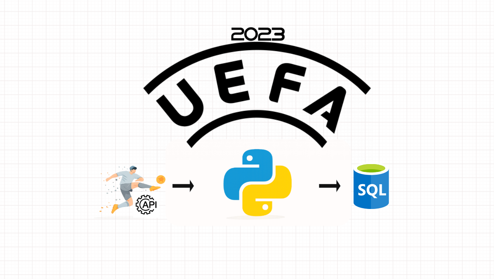

# ⚽ Football API ETL Pipeline

 

An ETL pipeline built with Python that extracts UEFA Championship standings from the API-Football REST API, transforms the JSON response into a structured Pandas DataFrame, and loads the cleaned data into SQL Server.

---

## 📌 Project Overview

This project demonstrates a complete ETL workflow:

1. **Extract**

   - Fetches football standings from the API-Football REST API.
   - Uses secure API authentication with environment variables.

2. **Transform**

   - Parses nested JSON.
   - Selects only the required fields.
   - Converts the response into a clean Pandas DataFrame.

3. **Load**

   - Connects to SQL Server using PyODBC.
   - Truncates the target table.
   - Loads the latest standings into SQL Server.

####The pipeline loads the following information into SQL Server:

-"Team information"
-"Ranking"
-"Points"
-"Goal difference"
-"Match statistics (Win, Draw, Loss)"
-"Goals scored and conceded"
-"Team form"

## 🛠️ Technologies Used

- REST API
- Python
- Pandas
- Requests
- PyODBC
- SQL Server

